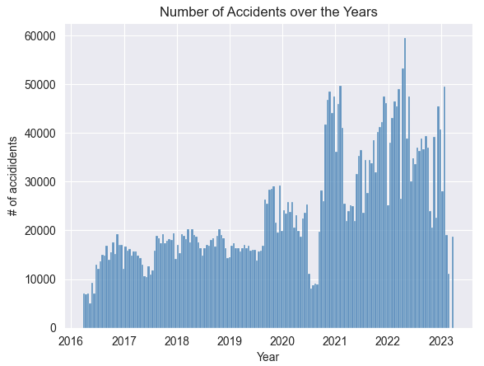
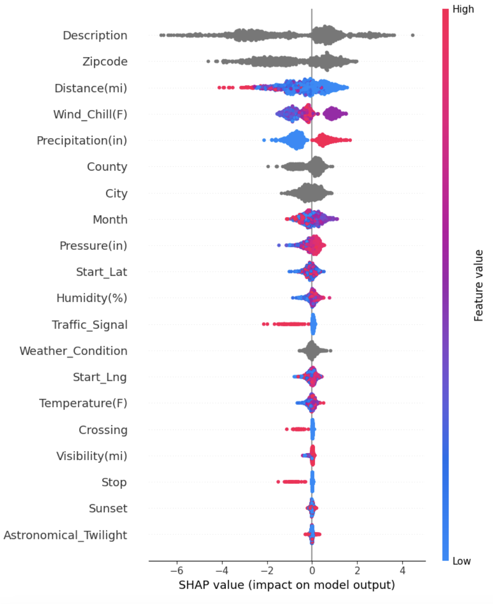
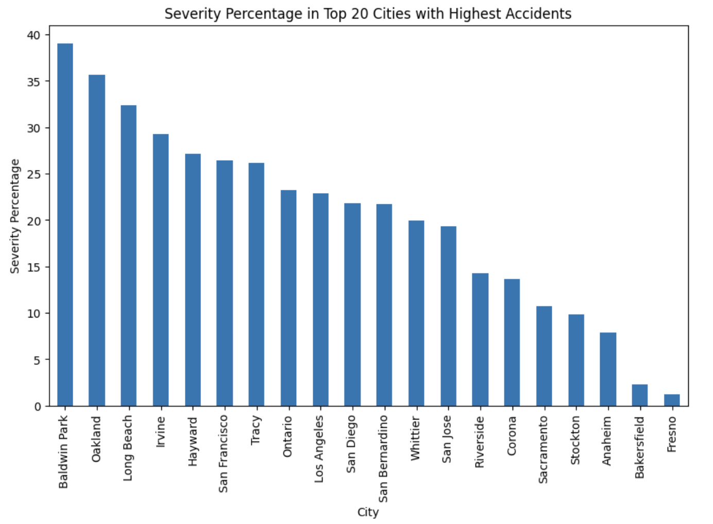

# Overview
Driving is an integral part of everyday life for many individuals. However, it's crucial to recognize that motor vehicle accidents remain a leading cause of death in America. Shockingly, there is a 1 in 107 chance of dying in a car crash.

## Business Proposition
In an effort to kickstart their comprehensive safety action plans aimed at mitigating the severity of vehicle accidents, the Department of Transportation (DOT) is seeking to identify the top three cities with the highest rate of severe crashes.

## Data Sources
- The data is sourced from Kaggle (https://www.kaggle.com/datasets/sobhanmoosavi/us-accidents/data)
- 7.7 million recorded accidents 
- The accidents are from February 2016 to March 2023. 
- Includes all states and DC, excluding Alaska and Hawaii

 

## Data Preparation
Due to the size of the dataset, I solely focused on the state of California as it has the highest number of accidents. 
 
For Data Cleaning, I removed irrelevant features such as 'Source', 'Country', 'Airport_Code', 'Timezone', and 'Wind_Direction'. To handle missing values in the Point of Interest columns, I imputed their respective mean values. Additionally, for categorical columns with null values, I chose to drop the corresponding rows.

## Modeling
Performed multiple model types such as Logistic Regression, Random Forest Classifier, and Catboost Classifier. 

Due to the class imbalanced, I used the recall score as my performance metric. After tuning the parameters for all my models using RandomizedSearchCV and GridSearchCV, Catboost Classifier demonstrated the best performance.

   
   
  It achieved a recall score of 94% for class 0 and 89% for class 1.

## Model Interpretability  

I utilized the SHAP library to gain deeper insights into the decision-making process of my CatBoost model and understand the importance of each feature in making predictions.
 

Here, we can see that Description, Zipcode, and Distance(mi) are the most significant features when making predictions for severity in accidents.
For Precipitation, it's evident that higher feature values correlate with more severe accidents, while the opposite trend can be observed for Traffic Signal.
## Conclusion
I recommend the DOT begin at the following cities as they have the highest severity percentages:
- Baldwin Park
- Oakland
- Long Beach

## For More Information
See the full analysis in the Jupyter Notebook or review this presentation. For additional info, contact Julie Leung.
