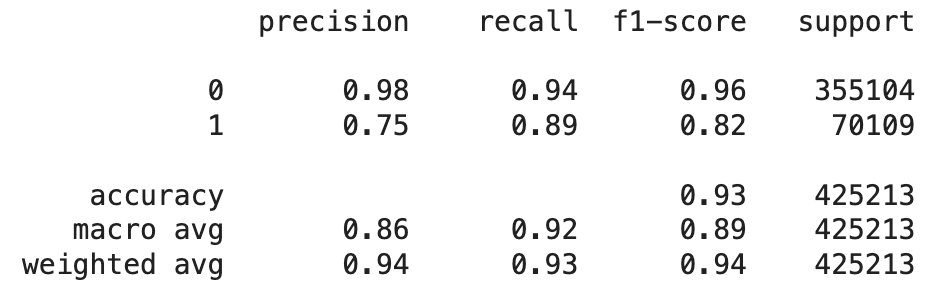
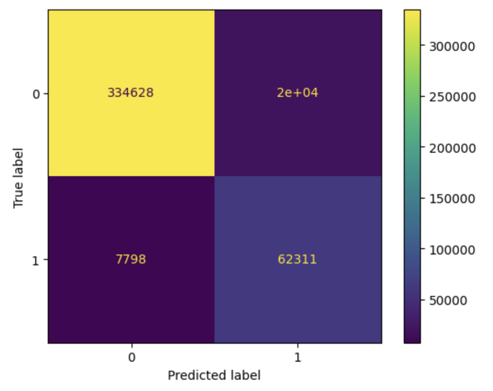

# Overview
Driving is an integral part of everyday life for many individuals. However, it's crucial to recognize that motor vehicle accidents remain a leading cause of death in America. Shockingly, there is a 1 in 107 chance of dying in a car crash.

## Business Proposition
 

## Data Sources
- The data is sourced from Kaggle (https://www.kaggle.com/datasets/sobhanmoosavi/us-accidents/data)
- 7.7 million recorded accidents 
- The accidents are from February 2016 to March 2023. 
- Includes all states and DC, excluding Alaska and Hawaii

## Data Preparation
 

## Modeling
Performed multiple model types such as Logistic Regression, Random Forest Classifier, and Catboost Classifier. 

Due to the class imbalanced, I used the recall score as my performance metric. After tuning the parameters for all my models using RandomizedSearchCV and GridSearchCV, Catboost Classifier demonstrated the best performance. It achieved a recall score of 94% for class 0 and 89% for class 1.

 

 
 
 

 

 

## Conclusion

 

## For More Information
See the full analysis in the Jupyter Notebook or review this presentation. For additional info, contact Julie Leung.
